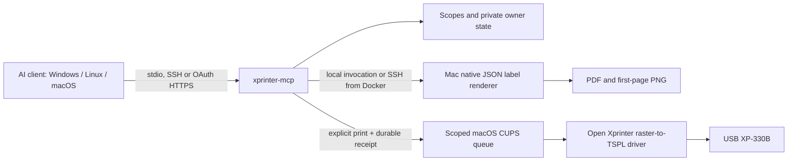

# Why a separate repository

`xprinter-macos` owns the macOS driver, native UI, universal Installer and shared label renderer. `xprinter-mcp` owns the MCP protocol, authentication, user isolation, durable print receipts and clients' setup guides. Independent versioning avoids rebuilding the native installer for a protocol or OAuth change.

The API is platform-neutral. A Windows/Linux/macOS AI client connects through the same MCP protocol. MCP can run on the printer Mac or in a Linux Docker container. `CupsPrinter` and `NativeRenderer` invoke macOS tools locally or through the `ssh.ts` command runner: only the USB driver and renderer need Mac/Open Xprinter 0.3.0+ in Docker mode. Future direct Windows/Linux USB hosts need separately implemented and hardware-tested `PrinterBackend`/`Renderer` adapters, not a second client API.

## Boundaries

- `schema.ts`: strict Zod input and output contracts; no path/URL/raw-command tool input.
- `server.ts`: one tool/resource/prompt definition, used by both protocol eras/transports; official SDK scope challenges.
- `service.ts`: shared physical printer budgets, preparation and print workflow; no automatic retry of an uncertain submission.
- `store.ts`: private local SQLite state, owner filtering, TTL/quota and transactional idempotency reservation.
- `native.ts`: separately replaceable printer/renderer interfaces, fixed macOS executables, argument arrays, bounded subprocesses, verified CUPS job identity before cancellation.
- `ssh.ts`: operator-configured target, strict pinned host keys, dedicated key-file authentication, safe POSIX argument quoting, no agent/TTY/forwarding/retry, persistent Docker state guard. PDF and fixed IPP requests stream to the Mac over encrypted stdin; credentials never come from an MCP caller.
- `auth.ts` / `http.ts`: external OAuth resource-server verification, protected resource metadata, loopback by default; explicit container listener with host-loopback publication, Host/Origin/CORS/body/rate/concurrency limits.
- `cli.ts`: stdio, authenticated HTTP and read-only doctor; stdout is reserved for the protocol in stdio mode.

## Retry semantics

The store commits a receipt **before** invoking `lp`. The receipt starts `uncertain`; it becomes `submitted` only after CUPS returns an identifiable queue/job number. A duplicate `(owner, idempotencyKey)` returns that receipt; changed artifact/copies under the same key are rejected. `BEGIN IMMEDIATE` and a uniqueness constraint protect parallel server processes using the same local state directory.

SQLite and CUPS do not share a transaction. There is a small crash window in which paper may have been submitted but its CUPS ID was not saved. Returning `uncertain` and refusing automatic replay avoids pretending that physical printing is exactly once. A human can inspect CUPS and paper, then intentionally create a new key. Database loss, deliberate new keys and receipt expiry can all permit another physical print.

HTTP creates a fresh SDK server per request while keeping the same service/store. Each factory receives only validated authentication context. Stdio binds to the local OS account; clients running as that account share its local identity. SSH uses the remote account's same local trust boundary. No long-lived HTTP session is used as authorization.

MCP cancellation is checked before dispatching printer mutations. Once CUPS submission starts, the server finishes collecting/persisting its receipt even if the client cancels or disconnects; cancellation of a protocol request cannot undo paper. Use `cancel_job` for an identified unfinished CUPS job. UUID inputs are normalized so a case change cannot accidentally create a distinct retry key.

## Native rendering

The app's `--mcp-render` entry point reads bounded JSON to EOF, shares `LabelRenderer` with the GUI and returns PDF plus first-page PNG. The server verifies app version before invoking it, so an older executable cannot accidentally launch the GUI for an unknown option. The Mac driver controls physical dimensions, gap/mark origin and printer-dot output. The Node component never loads proprietary SDKs or constructs raw TSPL.

Rendering has size/pixel/time bounds but is not an OS sandbox. Keep the Mac and Node patched and restrict access to trusted users, especially when accepting arbitrary PDFs. Hosted remote usage requires operator-selected identity/TLS infrastructure; the repository cannot create a domain or OAuth tenant for an arbitrary user.
